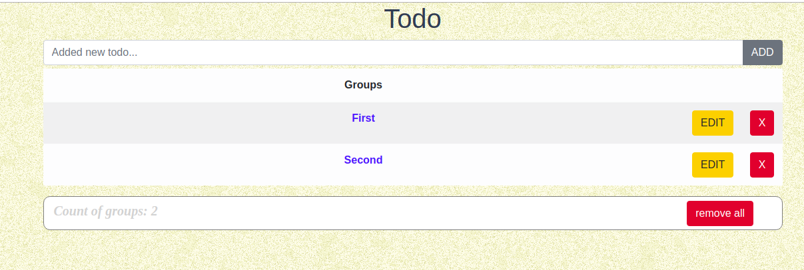

# ToDo-list v.2.1
This application is a slightly upgraded todo application.

<p align="center">
  <a href="" target="_blank">
    
    <br>
    Live Demo
  </a>
</p>

## Project setup

To install the application you need:

```
git clone https://github.com/averlor/todo-list.git
```
Then install dependencies:

```
npm install
```

### Compiles and hot-reloads for development
```
npm run serve
```

### Compiles and minifies for production
```
npm run build
```

### Run your tests
```
npm run test
```

### Lints and fixes files
```
npm run lint
```

### Customize configuration
See [Configuration Reference](https://cli.vuejs.org/config/).
